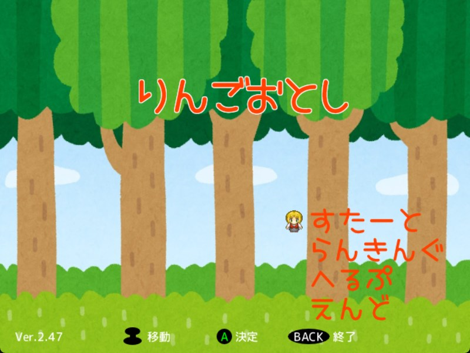

# りんごおとし
このゲームは制限時間30秒以内により多くのりんごを取り、スコアを競うゲームです。
 
🔗[紹介サイト](https://miyagi-yuta.com/appledrop/)
 

## 動作環境
 Windows 10 64bit 以降
コントローラーの入力方式：DirectInput・XInput両対応。
 
## 操作方法

### タイトル画像
|入力 |操作		|
|:-----:|:-------------------------:|
|アナログスティック上下左右|選択	|
|A   |決定	|
|B|戻る	|
|BACK|ゲーム終了	|
 

### ゲーム画面
|入力 |操作		|
|:-----:|:-------------------------:|
|アナログスティック左右|プレイヤー左右移動	|
|START|ポーズ	|
|BACK|ゲーム終了	|

 

### ランキング名前入力画面
|入力 |操作		|
|:-----:|:-------------------------:|
|アナログスティック上下左右|選択	|
|A   |入力	|
|B   |1文字削除	|
|START|名前確定	|

## ライセンス  
### 画像  
・players.png
[ぴぽや倉庫](https://pipoya.net/sozai/)  
・cat.png  
[くまみね工房](https://kumamine.blogspot.com/)  
・apple.png, greenapple.png, purpleapple.png, yellowapple.png  
[かわいいフリー素材集 いらすとや](https://www.irasutoya.com/)  
・background.png, pause.png  
